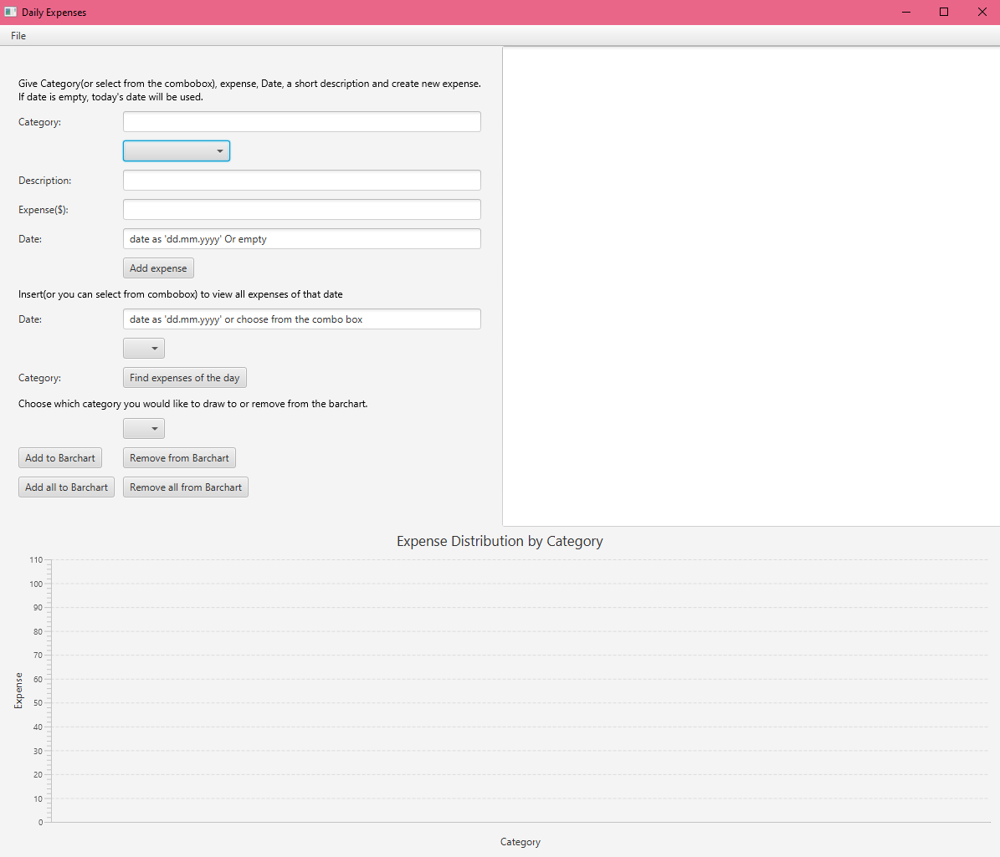
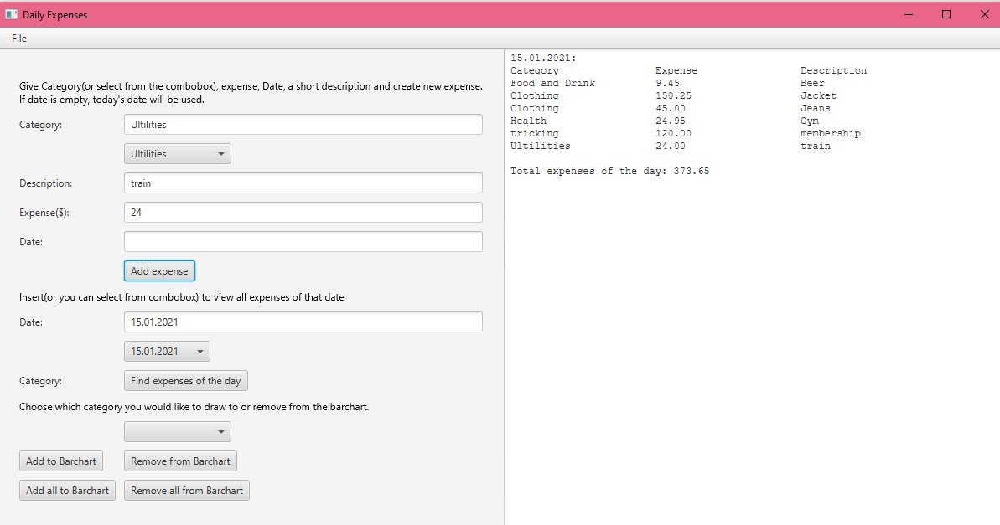
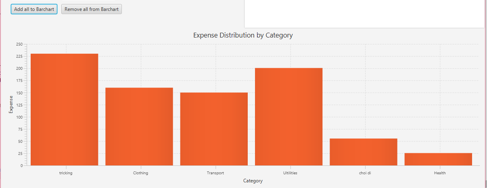

# Grocery-List-app
Java application with GUI using JavaFx

**1. Project Description:**

A program for tracking daily expenses. Users can input a date, expenses of that day and can save it to a file. Moreover, The program can search a date and view all expenses
of that date.
The program provides a tool which users can view the total sum by category and draw that to a bar chart.
Users can also save the expenses into a “.dat” file and data can be read from file.
It is required to have JavaFx Library to run this application. JavaFX can be downloaded: https://gluonhq.com/products/javafx/

**2. Source Code Explanation:**

My program has total 5 classes:
- ExpenseApplication class: this class contains the GUI of the application, all the functions that
needed to run the program e.g. Add an expense, Find expenses by date, Save to file,...
- Item class: Each object of this class will represent an expense. An expense consists of money sum, a category name that it belongs to, and a short description.
- DayExpense class: Each object of DayExpense represents a date with all enpenses of that date. The expenses of the date is stored in an ArrayList.
- AllExpenses class: An object of this class represents every expenses of everyday. It has an ArrayList for storing all the expenses, excluding the date data.
- Date class: this class is to display the String format into Date object. It provides method for comparing between two dates.

**3. Screen-shot of working program:**

